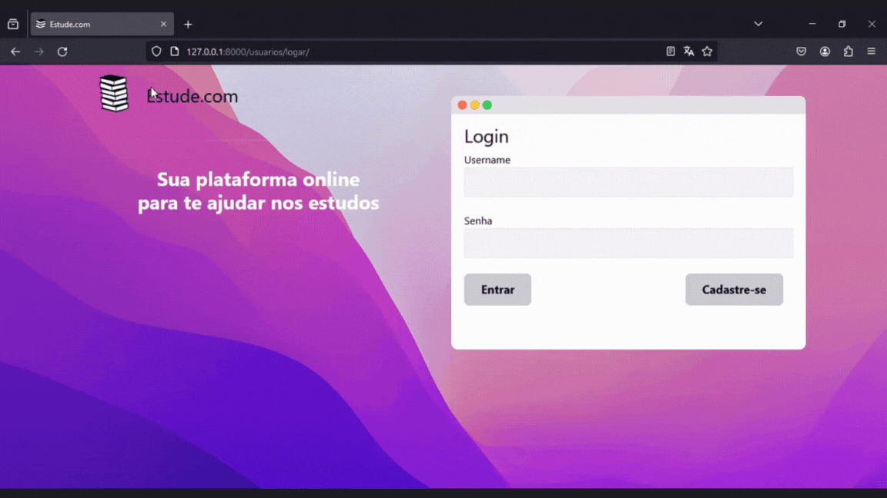
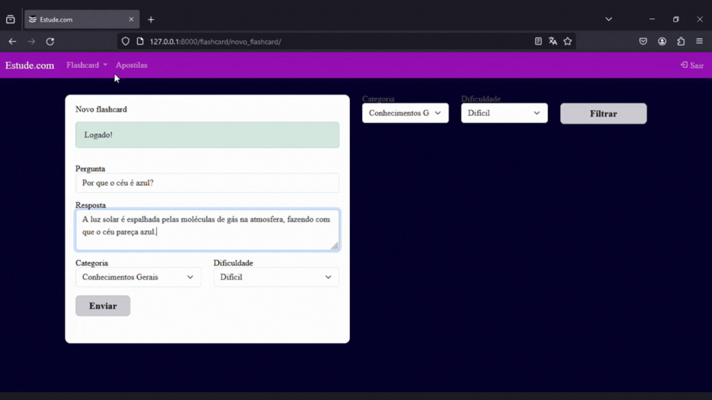
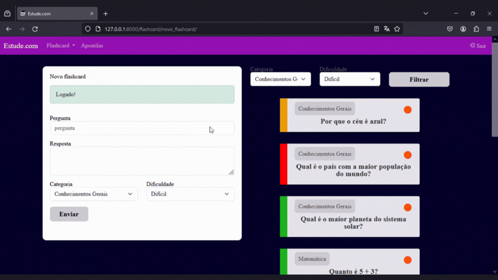
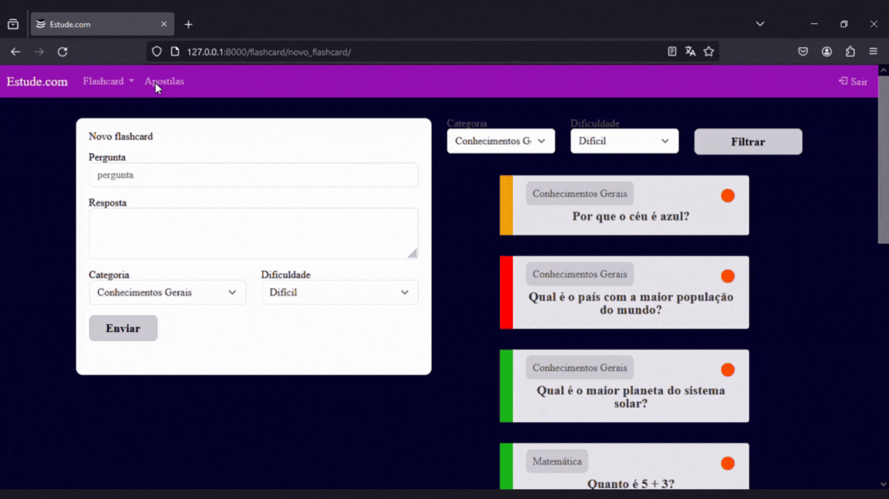

# Plataforma de Estudos

Este projeto é uma plataforma de estudos, desenvolvida com o objetivo de oferecer uma experiência integrada e eficaz para estudantes de todas as áreas. Utilizando tecnologias como Python e Django, ao integrar recursos como flashcards, desafios interativos e análises de desempenho, a plataforma visa tornar o processo de estudo mais envolvente, organizado e eficiente, de forma a facilitar o aprendizado e o acompanhamento do progresso acadêmico.


## Tecnologias Utilizadas:

- [Python](https://www.python.org/): Linguagem de programação.
- [Django](https://www.djangoproject.com/): Framework web de alto nível para Python.
- [Pillow](https://pypi.org/project/Pillow/10.2.0/): Biblioteca de processamento de imagens para Python.
- [SQLparse](https://pypi.org/project/sqlparse/0.4.4/): Um analisador SQL para Python.


## Principais Funcionalidades:

<div align="center">
    <h3>Cadastro e Login de Usuários:</h3>
    <p>Os usuários podem criar facilmente contas personalizadas e fazer login de forma segura para acessar os recursos da plataforma.</p>
    
</div>

---

<div align="center">
    <h3>Gestão de Flashcards:</h3>
    <p>A funcionalidade de flashcards permite aos usuários criar, visualizar e organizar cartões de estudo com informações relevantes, facilitando a revisão e memorização de conceitos-chave.</p>
    
</div>

---

<div align="center">
    <h3>Desafios com Flashcards e Análise Gráfica de Desempenho:</h3>
    <p>Os usuários têm a capacidade de criar e participar de desafios baseados em flashcards, tornando o processo de aprendizado mais interativo e divertido. Também há uma seção que fornece análises visuais do desempenho dos usuários em desafios concluídos, destacando áreas de melhores e piores desempenho.</p>
    
</div>

---

<div align="center">
    <h3>Apostilas de Estudo em PDF:</h3>
    <p>Os usuários podem fazer upload de apostilas de estudo no formato PDF, organizadas por categorias e tags para uma fácil localização e acesso. A plataforma também rastreia o número de visualizações e fornece estatísticas úteis sobre o uso das apostilas.</p>
    
</div>

---

<div align="center">
    <h3>Gerenciamento de Sessão Seguro (Logouf):</h3>
    <p>Implementação de um sistema de logout seguro (Logouf) para garantir a segurança das sessões dos usuários e proteger suas informações pessoais.</p>
    
</div>


## Como Utilizar

**Python e Django Instalados:**
Certifique-se de que o Python e o Django estão instalados em seu sistema.

### Passos:

1. **Clone o Repositório:**
    Clone o repositório do projeto em seu computador utilizando o Git:
     ```bash
     git clone https://github.com/seu-usuario/nome-do-repositorio.git
     ```

2. **Criar e Ativar a Venv:**
     Crie uma virtual environment (venv) utilizando o Python:
     ```bash
     python -m venv venv
     ```
     Ative a venv. No Windows:
     ```bash
     venv\Scripts\activate
     ```
     No macOS e Linux:
     ```bash
     source venv/bin/activate
     ```

3. **Instalar as Dependências:**
     Com a venv ativada, instale as dependências do projeto a partir do arquivo "requirements.txt":
     ```bash
     pip install -r requirements.txt
     ```

### Executar o Projeto:

1. **Iniciar o Servidor Django:**
    Após instalar as dependências, inicie o servidor Django no diretório do projeto:
     ```bash
     python manage.py runserver
     ```

2. **Acessar a Plataforma:**
    Abra um navegador web e acesse:
     ```
     http://127.0.0.1:8000/
     ```


### Divirta-se!
   